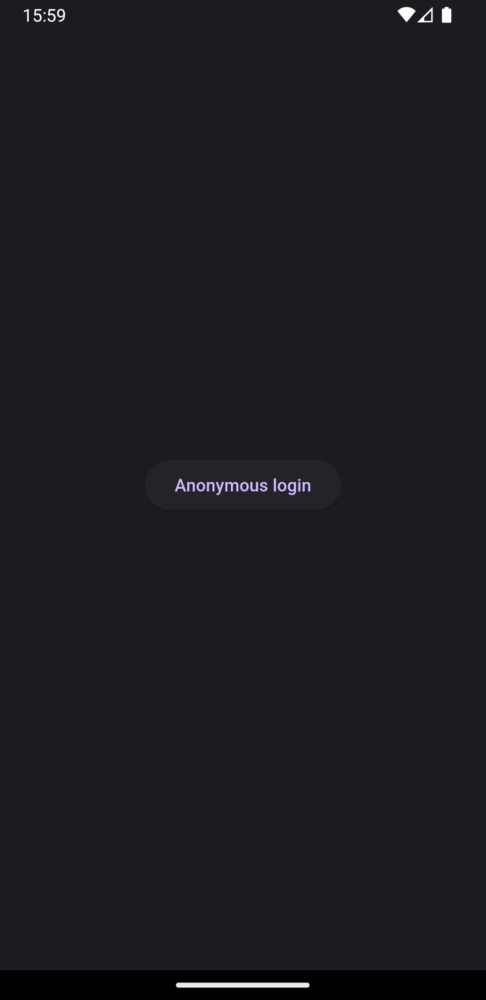
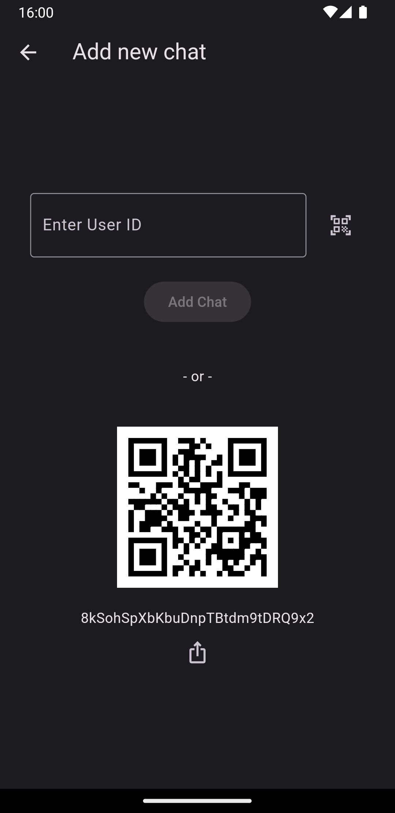
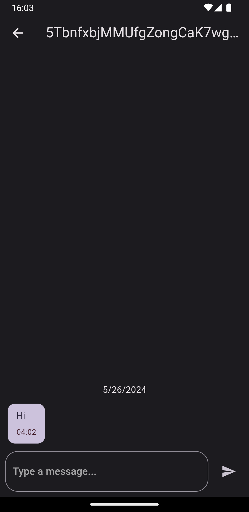
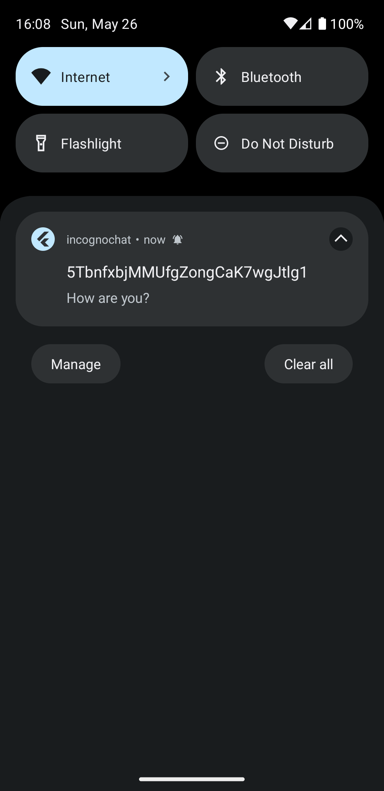
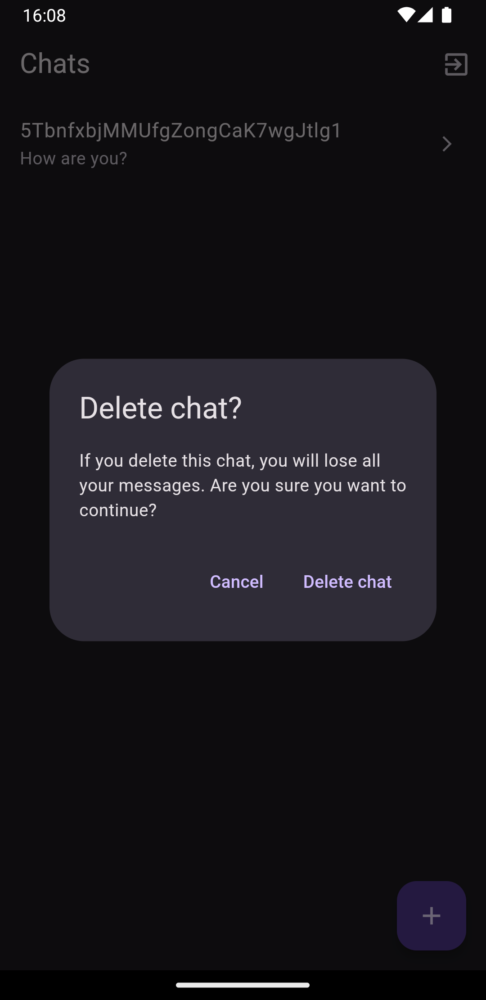
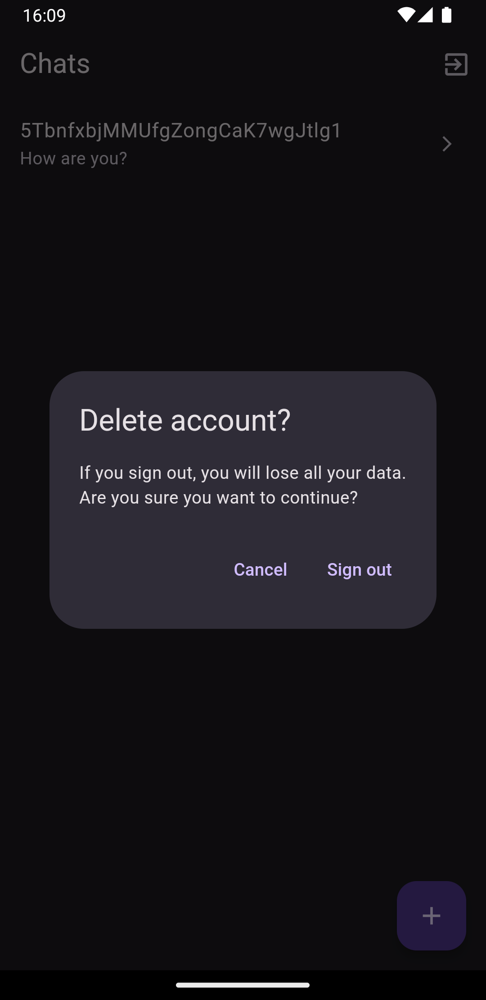

# IncognoChat

IncognoChat is a fully open source Flutter chat application that prioritizes user anonymity. The app utilizes Firebase Anonymous Authentication for account creation, ensuring users remain untraceable. Once logged out, users cannot log back into the same account, enhancing privacy. Inactive accounts and their data are automatically deleted after 30 days. This README provides details on the app's features, setup instructions, and additional resources.

## Features

- **Anonymous Login Only**
  - Users can only create accounts through Firebase Anonymous Authentication.
  - Ensures complete anonymity and privacy.
  - 
&nbsp;
- **Chat via Firebase UID**
  - Users can only chat by sharing their Firebase UID.
  - Facilitates secure and private communication.
  - 
&nbsp;
- **Realtime Communication**
  - Users can send and receive messages realtime.
  - 
&nbsp;
- **Firebase Cloud Messaging (FCM)**
  - Receive notifications for new messages.
  - Seamless integration with FCM for instant alerts.
  - 
&nbsp;
- **Chat Deletion**
  - Deleting a chat removes it from both participants' histories.
  - Ensures that no traces are left behind.
  - 
&nbsp;
- **Inactive Account Deletion**
  - Accounts that haven't signed in for more than 30 days are automatically deleted.
  - Maintains a clean and up-to-date user base.
  - 
&nbsp;
## Installation

1. **Clone the Repository**
   ```sh
   git clone https://github.com/ravanalaskarov/ingocno-chat.git
   cd IncognoChat
   ```

2. **Setup Firebase**
   - Create a Firebase project at [Firebase Console](https://console.firebase.google.com/).
   - Configure your Firebase project by following [Firebase documentation](https://firebase.google.com/docs/flutter/setup).
   - Enable anonymous authentication.
   - Set up Firebase Cloud Messaging (FCM).
   

3. **Run the App**
   - Ensure you have Flutter installed. If not, follow the instructions at [Flutter's official website](https://flutter.dev/docs/get-started/install).
   - Use the following command to run the app:

     ```sh
     flutter pub get
     flutter run
     ```

## Firebase Cloud Functions
Switch to blaze plan if you want to use Cloud Functions.

Follow the insturactions at [Firebase Console](https://console.firebase.google.com/) to set up Cloud Functions.

The Firebase Cloud Functions are located in the [index.js](functions/index.js) file. These include:

- **Account Deletion Function**
  - Deletes accounts that have not signed in for over 30 days.
  
- **Notification Function**
  - Sends notifications using Firebase Cloud Messaging (FCM) when a message is received.


## Firebase Firestore Rules

Unauthenticated users can't access database.

```
service cloud.firestore {
  match /databases/{database}/documents {
    match /{document=**} {
      allow read, write: if isUserAuthenticated();
    }
    
    function isUserAuthenticated() {
      return request.auth.uid != null; 
    }
  }
}
```


## Usage

Check out the example YouTube video below on how to use IncognoChat:

[IncognoChat Tutorial](https://www.youtube.com/watch?v=0Q108GtPCKk)

## Contributing

Contributions are welcome! If you have any ideas, suggestions, or bug reports, please open an issue or submit a pull request.

## License

This project is licensed under the MIT License - see the [LICENSE](https://github.com/ravanalaskarov/incogno_chat/blob/main/LICENSE) file for details.